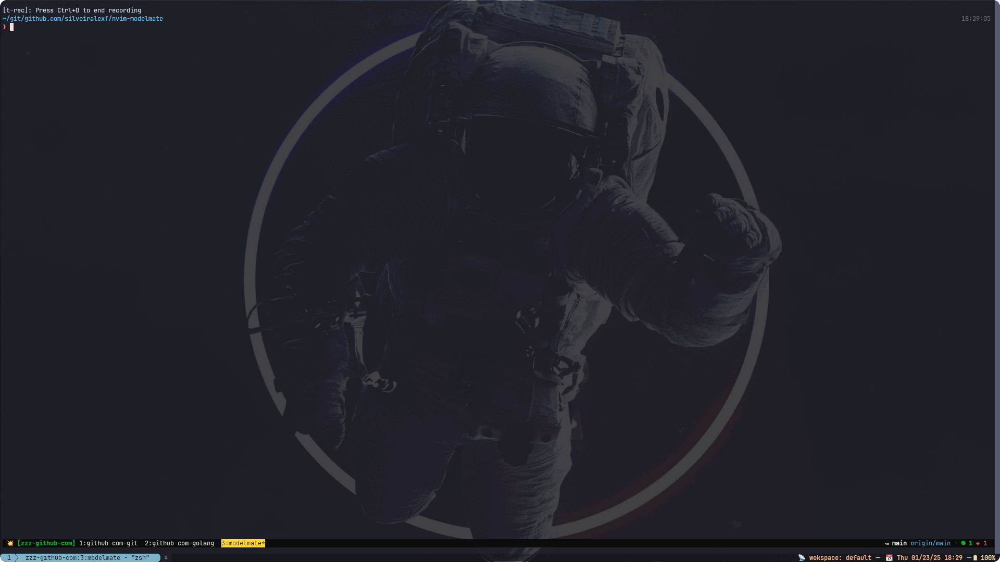

# nvim-modelmate

LLM coding mate for Neovim.



## Requirements

Ensure the tools listed below, are installed and accessible from Neovim' path.

- [Ollama](https://github.com/ollama/ollama)
- [AmazonQ CLI](https://docs.aws.amazon.com/amazonq/latest/qdeveloper-ug/command-line.html)

## Installation

Use your favorite package manager to install the plugin:

### LazyVim

```lua
{
    'silveiralexf/nvim-modelmate'
}
```

You can provide the following optional configuration table to the `setup`
function, for setting a different model on Ollama:

```lua
  {
    'silveiralexf/nvim-modelmate',
    config = function()
      require('nvim-modelmate').setup({
        debug = false,
        model = 'llama3:8b',
      })
    end,
  }
```

### Packer

```lua
use 'silveiralexf/nvim-modelmate'
```

### Vim-Plug

```lua
Plug 'silveiralexf/nvim-modelmate'
```

## Keybindings

You may set custom keybindings like this:

```lua
-- nvim/lua/config/keymaps.lua

-- Wrapper for vim.keymap.set function
local function map(mode, lhs, rhs, opts)
  vim.keymap.set(mode, lhs, rhs, opts)
end

map('n', '\\m', '', { desc = 'ModelMate' })
map('n', '\\mo', '<cmd>ModelLlama<cr>', { desc = 'ModelLlama-chat' })
map('n', '\\mq', '<cmd>ModelQ<cr>', { desc = 'ModelQ-chat' })
map('n', '\\mg', '<cmd>ModelQgit<cr>', { desc = 'ModelQ-Git ask?' })
map('n', '\\mh', '<cmd>ModelQhist<cr>', { desc = 'ModelQ-History ask?' })
```

## Usage

Use on of the following auto-commands for directly chatting in a new
`Terminal` window where you can start chatting with your LLM.

<!-- markdownlint-disable MD013 -->

| Command       | Description                                                                     |
| ------------- | ------------------------------------------------------------------------------- |
| `:ModelLlama` | Creates a chat window to interact with Ollama                                   |
| `:ModelQ`     | Creates a chat window to interact with AmazonQ                                  |
| `:ModelQhist` | Interact with AmazonQ with shell history context loaded                         |
| `:ModelQgit`  | Interact with AmazonQ with current repository git contextual information loaded |

- To interact in the chat session, just enter insert mode with default binding,
  `<ESC> + i`.
- To exit `Terminal` mode, which locks the focus within the buffer, use `<CTRL> + \ <CTRL> + n`.
- To end the session use `<CTRL> + c`.

## References & Inspirations

A big shout-out to thank the amazing folks, from which I borrowed ideas (and code),
for this plugin:

- [jpmcb/nvim-llama](https://github.com/jpmcb/nvim-llama)
- [Jacob411/Ollama-Copilot](https://github.com/Jacob411/Ollama-Copilot)
